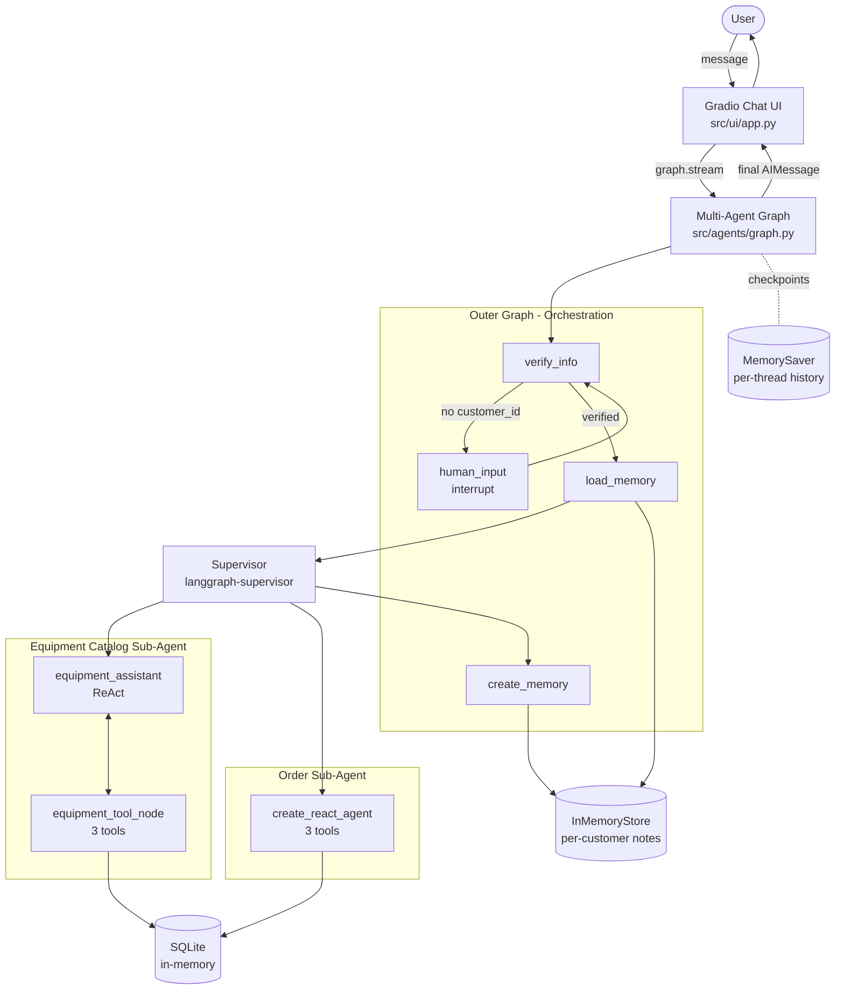

# Arihant Healthcare Multi-Agent Support System

A production-grade, **LangGraph-powered hierarchical multi-agent assistant** for **Arihant Healthcare**, a B2B/B2C medical equipment supply business. It combines a **Supervisor router**, two specialized **ReAct sub-agents** (equipment catalog + order tracking), **human-in-the-loop identity verification**, **long-term per-customer memory**, and a **Gradio chat UI** - all backed by a real relational schema for medical supplies.

**Live Demo:** [huggingface.co/spaces/jaina/Multi-Agent-Customer-Support](https://huggingface.co/spaces/Jainam182/Multi-Agent-Customer-Support)

---

## Capstone Framing

This project represents a fully assembled multi-agent AI system incorporating structured state management, persistent memory, safety controls, deterministic execution, and real-world data integration.

### Problem Statement

Customer support for a medical supply business has two opposing requirements:

1. **Conversational flexibility** - customers ask in free-form natural language ("Do you have oxygen concentrators?", "What's the status of my ICU bed order?").
2. **Operational correctness** - order status, product prices, and customer accounts must be exact, auditable, and access-controlled. Especially in healthcare, providing incorrect info or unauthorized medical advice is a huge risk.

A single LLM with a single system prompt cannot satisfy both. This project solves that gap with a **hierarchical agent graph** where each responsibility is isolated into its own node.

### About Arihant Healthcare

**Arihant Healthcare** is a Mumbai-based medical equipment and healthcare products supply business specializing in essential and critical-care devices. Operating in both the **B2B** (hospitals, clinics, nursing homes) and **B2C** (individual patients, home healthcare) spaces, the company focuses on providing reliable, fast, and affordable access to medical equipment. 

**Core Product Categories:**
* **Respiratory Equipment:** Oxygen Concentrators, BiPAP, and CPAP Machines.
* **Hospital & ICU Equipment:** ICU Beds, Patient Monitors, and Medical Furniture.
* **Consumables:** Surgical Gloves, Masks, and PPE Kits.

The multi-agent assistant is designed to support the following critical user journeys while maintaining strict healthcare safety rules (no medical diagnosis allowed):

| Journey | Entry Point | Guardrails |
|---|---|---|
| **Pre-Sales / Product Discovery** | Anonymous product queries | Tool-grounded only; exact quotes on price & stock. |
| **Order & Post-Sales Tracking** | Customer ID, email, or phone | Human-in-the-loop verification before fetching records. |
| **Emergency Handling** | Urgent keywords | Direct refusal/escalation to human experts. |

---

## System Architecture

### High Level System Architecture



---

## Data Flow & Tools

### Equipment Catalog Tools (`src/tools/equipment_catalog.py`)

| Tool | Signature | Returns |
|---|---|---|
| `get_products_by_category` | `(category_name: str)` | Products by category (fuzzy matching) |
| `search_products_by_name` | `(product_name: str)` | List of matching products with price & stock |
| `get_product_details` | `(product_id: str)` | Complete details including description |

### Order Tools (`src/tools/order_support.py`)

| Tool | Signature | Returns |
|---|---|---|
| `get_orders_by_customer` | `(customer_id: str)` | All orders DESC by date |
| `get_order_details` | `(order_id, customer_id)` | Product line items for a specific order |
| `get_employee_by_order_and_customer` | `(order_id, customer_id)` | Support rep name / title / email |

---

## Getting Started

### Prerequisites

- Python **3.12**
- A Groq API key (get one for free at [console.groq.com](https://console.groq.com/keys))
- Git.

### Quick Start

```bash
# 1. Clone
git clone https://github.com/jaina/Multi-Agent-Customer-Support.git
cd Multi-Agent-Customer-Support

# 2. Virtualenv
python3.12 -m venv venv
source venv/bin/activate            # Windows: venv\Scripts\activate

# 3. Deps
pip install -r requirements.txt

# 4. Config
cp .env.example .env
# edit .env → set GROQ_API_KEY

# 5. Run
python app.py
# → http://localhost:7860
```

### Sample Data
Try testing with Customer ID `5` (Rajesh) or `10` (Sneha).
Ask about "Oxygen Concentrator" or "BiPAP".

### Developer Commands

```bash
# Full test suite (22 tests)
pytest tests/ -v
```

---

<div align="center">
  <sub>Built and maintained by <b>jaina</b> · LangGraph · Gradio</sub>
</div>
